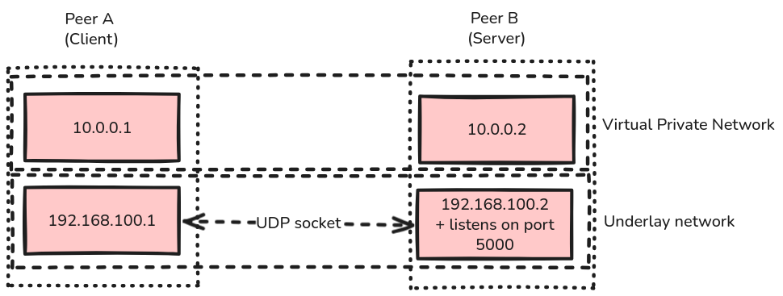

# Charon MVP

This is my wall of shame for the Charon tunnel project. It contains snippets of code that I have written to discover and learn about networking, DTNs, VPNs and other related topics. It is not meant to be a comprehensive guide, but rather a collection of notes and experiments that I have done along the way.

It works using git tags, so you can check out the different stages of the project by using `git checkout <tag>`.

## Table of tags

> Usage example `git checkout virtual-interface`

- `virtual-interface`: A simple tunnel that forwards TCP traffic from a virtual interface to a physical interface using the `ip` cli + a C program that reads from the virtual interface.
- `cat-tunnel`: A tunnel that replace "dog" with "cat" in the payload of TCP packets. Really simple, but it shows how to manipulate TCP packets in user space.


---

## Notes

### Cat tunnel

The network stack architecture of the cat tunnel is as follows:



In this setup, to run the project : 
1. Compile the cat tunnel program : 

```bash
make
```

2. Setup the dev environment : 

```bash
sudo ./setup-dev-env.sh
```

This will create two network namespaces `client`, `server` and a veth pair between them. It will also setup the routing rules and iptables rules to allow TCP traffic between the two namespaces on the underlay network.

3. Run the cat tunnel program in both namespaces : 

In one terminal, run the server :
```bash
sudo ip netns exec server ./tunnel 192.168.100.1 10.0.0.2
sudo ip netns exec server nc -l 4000
```

In another terminal, run the client :
```bash
sudo ip netns exec client ./tunnel 192.168.100.2 10.0.0.1
sudo ip netns exec client nc 10.0.0.2 4000
```

And type in "Hello I love dogs!" in the client terminal, you should see "Hello I love cats!" in the server terminal.


---

### Delay tolerant tunnel

1. Setup ud3tn node :

```bash
AAP2_SECRET="my_extremely_secret_secret_omg_i_love_this_secretly_secret_secret" ./ud3tn/result/bin/ud3tn \
  -b 7 \
  -c "sqlite:file::memory:?cache=shared;tcpclv3:*,4556;smtcp:*,4222,false;mtcp:*,4224" \
  -e dtn://peer-a.dtn/ \
  -l 86400 \
  -L 2 \
  -m 0 \
  -s $PWD/ud3tn.socket \
  -S $PWD/ud3tn.aap2.socket \
  -x "AAP2_SECRET"
```

---

# Targetted DX

1. Launch a TCP server using netcat :

```bash
nc -l 12345
```

2. Launch a DTN node for this server : 

```bash
./ud3tn/build/posix.ud3tn --node-id dtn://b.dtn/ --aap-port 4242 --aap2-socket ud3tn-b.aap2.socket --cla "mtcp:*,4224"
```

3. Launch a DTN node for the client :

```bash
./ud3tn/build/posix.ud3tn --node-id dtn://a.dtn/ --aap-port 4242 --aap2-socket ud3tn-a.aap2.socket --cla "mtcp:*,4225"
```


4. Send a message from the client to the server using netcat :

```bash
echo "Good morning Night City!" | nc 10.0.0.2 4225
```
